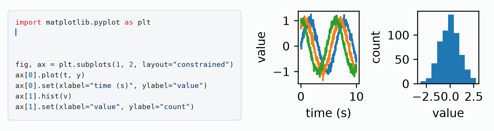
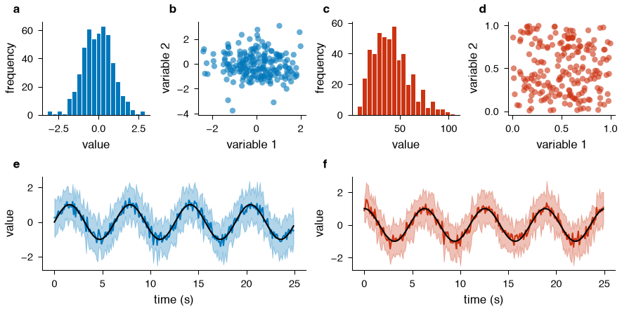

# SpiffyPlots

[](https://github.com/JRBCH/spiffyplots/actions/workflows/test.yaml)
[](https://spiffyplots.readthedocs.io/en/latest/?badge=latest)
[](https://badge.fury.io/py/spiffyplots)
[]()
[](https://github.com/JRBCH/spiffyplots/blob/master/LICENSE)

A collection of opinionated [matplotlib](https://github.com/matplotlib/matplotlib) style sheets and plotting tools for publication-ready figures.

Requires Python 3.10 or newer and matplotlib 3.8 or newer.

* Free software: MIT license
* Documentation (likely not up to date): https://spiffyplots.readthedocs.io.


## Installation

Install the latest release:
```bash
pip install spiffyplots
```
or install the latest commit directly from GitHub:
```bash
pip install git+https://github.com/JRBCH/spiffyplots.git
```

## Using the style sheets

Import `spiffyplots` and load the default `spiffy` style to get more sensible default plotting parameters across the board.



### What does it do?
Life is too short to look at ugly figures.
This style fixed that problem for me, and over time I added a bunch of quality-of-life features to it, such as:
- Editable vector text by default. PDF and PostScript files embed TrueType fonts, and SVG retains `<text>` elements instead of converting glyphs to paths.
- Sensible default colors, fonts, and font sizes.
- Zero outer padding for better control over the final figure size.

### Combining style sheets

The base `spiffy` style contains my own rather opinionated preferences for everyday use. You can combine it with other style sheets to match it to your use case. 

```python
import matplotlib.pyplot as plt
import spiffyplots 

plt.style.use("spiffy")  # base style only
plt.style.use(["spiffy", "tol-muted"])  # plus a color scheme
plt.style.use(["spiffy", "nature"])  # plus a journal-specific style
```

> [!NOTE]
> Import `spiffyplots` **before** calling `plt.style.use`. The import registers the style sheets.

### What styles are included?

| Type | Styles |
|---|---|
| Base | `spiffy` |
| Color | `tol-bright`, `tol-high-contrast`, `tol-light`, `tol-medium-contrast`, `tol-muted`, `tol-vibrant`, `okabe-ito` |
| Modifiers | `latex`, `latex-helvetica`, `minor-ticks`, `right-axis`, `top-axis` |
| Journals (beta) | `cell`, `elife`, `jmlr`, `jneurosci`, `nature`, `neuron`, `plos-compbiol`, `science`, `tmlr` |

### Why journal-specific style sheets?
Because journal guidelines are oddly specific and differ in some important details (e.g. whether a double-column figure is 175mm or 183mm wide), and I wanted a set-and-forget way of defining the journal style once, so I can focus on the actual data visualization. The API for this might change in future releases.

#### How to use Journal-specific styles:
Journal styles automatically apply journal guidelines.
They set a default figure dimension (double column by default), correct font sizes for all plot elements, and export resolution.
Some features, such as different figure size options, can instead be accessed through the `spiffyplots.journals` module.
For example, `spiffyplots.journals.nature.single_column(height=65, unit="mm")` returns a figure size in inches that matches Nature's single-column figure guidelines with your specified height.

## Multi-Panel figures

matplitlib's `GridSpec` is great, but I got real tired of formatting and re-formatting panel alignments. `MultiPanel` is my attempt of making this process easier. 

```python
import matplotlib.pyplot as plt
from spiffyplots import MultiPanel
plt.style.use("spiffy")

figure = MultiPanel(
    grid=[4, 2],    # 4 panels in the first row, 2 in the second
    labels=True     # label panels (a, b, c, ...)
)

# Access each subplot axis by its label
figure.panels.a.hist(data)
figure.panels.b.scatter(x1, x2)
(...)
```




See [examples/ex_multipanel.py](examples/ex_multipanel.py) for the full example and a comparison to the default matplotlib style. 
There are many other ways to define `MultiPanel` layouts, label placements, grid arrangements etc, see the [example notebook](examples/Spiffplots%20Demo%20-%20MultiPanel.ipynb) for a short tutorial.

> [!NOTE]
> Since I wrote this module, matplotlib has added [`subplot_mosaic`](https://matplotlib.org/stable/api/_as_gen/matplotlib.pyplot.subplot_mosaic.html), which solves a very similar problem.
> I may rework `MultiPanel` to wrap that instead of `GridSpec` one day, or stop using it all together, but for now I still prefer the spiffy interface.

## Colors and colormaps

Style sheets only set the default cycle. For easy access to sensible colors, I use `spiffyplots.colors` for discrete colors and `spiffyplots.cmap` for colormaps. 
I really love [Paul Tol's](https://sronpersonalpages.nl/~pault/) color schemes, so I heavily rely on them.

```python
import spiffyplots as spiffy

scheme = spiffy.colors.tol_vibrant
color1 = scheme.red  # '#CC3311'
color2 = scheme.blue  # '#0077BB'

spiffy.colors.from_cmap(spiffy.cmap.sequential, 6)  # 6 equally spaced colors
spiffy.colors.shades(color1, 5)  # 5 shades of one base color
```

**Schemes:** `tol_bright`, `tol_high_contrast`, `tol_vibrant`, `tol_muted`,
`tol_medium_contrast`, `tol_light`, `tol_pale`, `tol_dark` and `okabe_ito`.
Each is a tuple you can index, slice and iterate, whose colors are also
reachable by name. Each runs in its author's recommended order, then black,
then grey.

### Colormaps

Again, I wrapped [Paul Tol's](https://sronpersonalpages.nl/~pault/) colormaps together with the default matplotlib colormaps in a convenient way for access & modification:

```python
cmap = spiffy.cmap.sequential  # default sequential colormap (Paul Tol's iridescent)
cmap = spiffy.cmap.diverging  # default diverging colormap (Paul Tol's nightfall)
cmap = spiffy.cmap.iridescent_r  # a specific colormap, reversed
cmap = spiffy.cmap.viridis  # falls through to matplotlib
```

You can also create colormaps from one or more base colors:

```python
cmap = spiffy.cmap.from_base(color1)  # white -> color -> darker color
cmap = spiffy.cmap.from_colors(spiffy.colors.tol_muted)
```

### Perceptually uniform colormaps

[cmcrameri](https://github.com/callumrollo/cmcrameri) and
[Colorcet](https://github.com/holoviz/colorcet) do this exceptionally well,
and `spiffy.cmap` can access their colormaps once either is installed.
To install them together with `spiffyplots`:

```console
pip install "spiffyplots[colormaps]"
```

You can then access them through `spiffy.cmap` as well:

```python
import spiffyplots as spiffy

cmap = spiffy.cmap.batlow  # cmcrameri, registered as `cmc.batlow`
cmap = spiffy.cmap.kbc  # colorcet, registered as `cet_kbc`
```

## Credits

* Most color schemes are [Paul Tol's](https://sronpersonalpages.nl/~pault/),
  redistributed under the 3-clause BSD license.

* Shoutout to [cmcrameri](https://github.com/callumrollo/cmcrameri) and
  [Colorcet](https://github.com/holoviz/colorcet) for their beautiful perceptually uniform colormaps.
