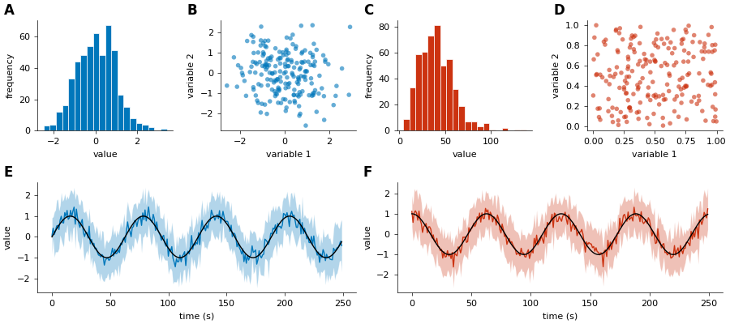

# SpiffyPlots

A collection of matplotlib style sheets and plotting tools for publication-ready figures.

* Free software: GPL-3 license
* Documentation: https://spiffyplots.readthedocs.io.

#### Simple style example:

## Installation

Install the latest release:

`pip install spiffyplots`

or install the latest commit directly from GitHub:

`pip install git+https://github.com/JRBCH/spiffyplots.git`

## Features

* Matplotlib style sheets
    * General style sheets for quick and beautiful out-of-the-box plotting
    * Color style sheets for [Paul Tol's color schemes](https://personal.sron.nl/~pault/)

* Multi-panel figures
    * Easy and flexible wrapper of matplotlib's GridSpec
    * Automatic labelling of sub-panels
    * Support for custom panel arrangements and labels

## Future Plans

* Journal-specific style sheets
* Automatic optimization of figure size for multipanel figures
* `color` module for quick access to colors and cmaps
* `panel` wrapper class for matplotlib axes objects with custom plotting methods for often used plots.

## Credits

 * This package was created with Cookiecutter and the `audreyr/cookiecutter-pypackage` project template.

 * The idea for easy-to-use and pypi-deployable matplotlib stylesheets stems from John Garrett's
 [SciencePlots](https://github.com/garrettj403/SciencePlots) package.
